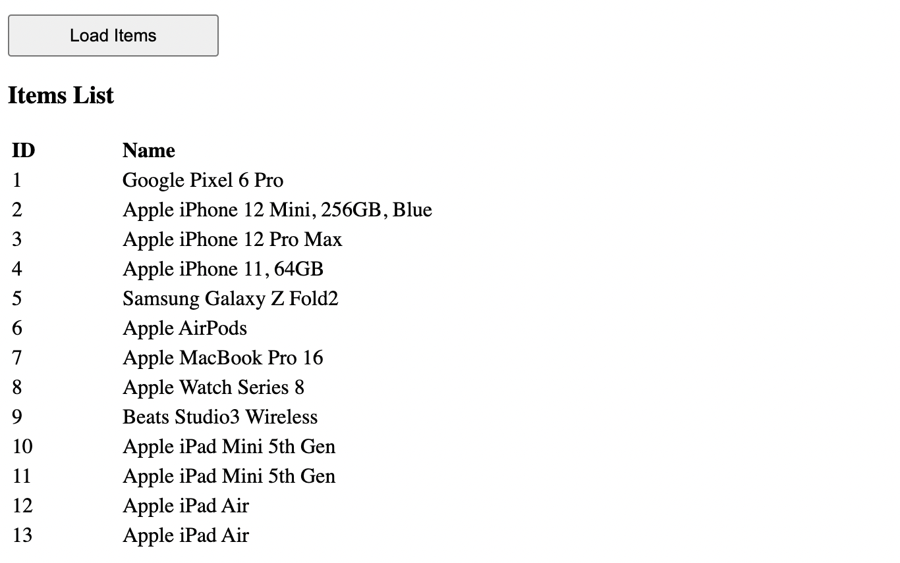

# Simple Angular store implementation

Main idea is that there is no need in special state managers to handle Angular's app state -- any injectable service could be a "store" -- changing its exported props cause re-render of the templates that referring to those props.

Inspired by [this](https://medium.com/@hclatomic/stop-using-ngrx-in-angular-a3ab7c694a14) article.

